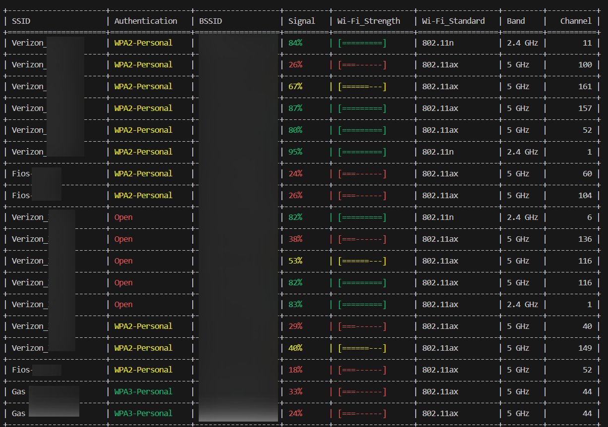
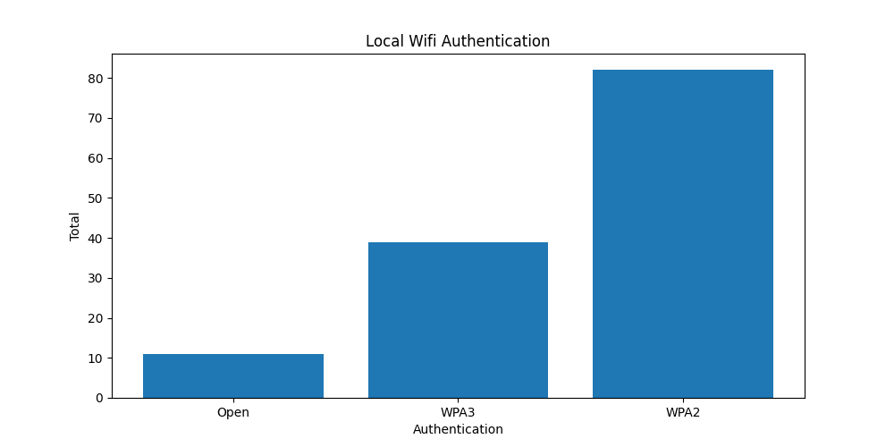
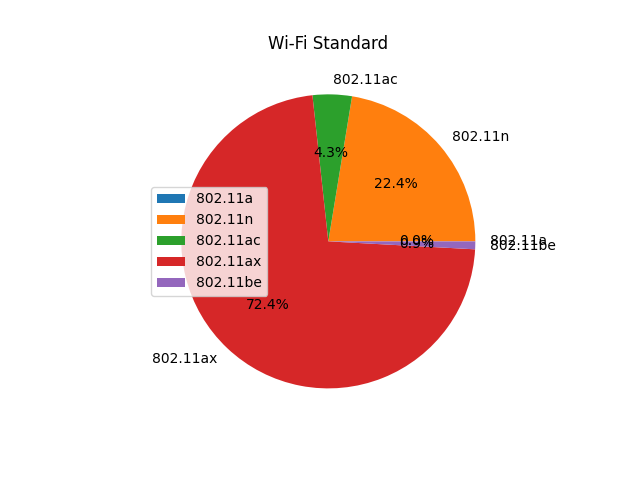

# Windows Wifi Scanner

### Packages

- <a href="https://pypi.org/project/tabulate/">Tabulate</a>
- <a href="https://pypi.org/project/colorama/">Colorama</a> 

### Modules

- Subprocess
- Re (Regular Expression)
  
### Results
 
 
 

